# eCare web application Technical Solution Description

```
Developed by
Andrew Golubev
golubevcg@gmail.com

Java School, Deutsche Telekom IT Solutions
2020
```
## Content

- 1 [Introduction](#1-Introduction)
- 2 [Technologies](#2-Technologies)
- 3 [Model](#3-Model)
   - 3.1 [Entity description](#31-Entity-description)
   - 3.2 [Database scheme](#32-Database-scheme)
- 4 [Architecture description](#4-Architecture-description)
- 5 [User interface](#5-User-interface)
   - 5.1 [Client account](#51-Client-account)
      - 5.1.1. [Entrance and login pages](#511-Entrance-and-login-pages)
      - 5.1.2. [Clients account page and contract page](#512-Clients-account-page-and-contract-page)
      - 5.1.3. [Cart page](#513-Cart-page)
   - 5.2 [Employee account](#51-Client-account)
      - 5.2.1 [Searches and header](#51-Client-account)
      - 5.2.2 [New user registration](#51-Client-account)
      - 5.2.3 [Contract editing](#51-Client-account)
      - 5.2.4 [Tariff editing](#51-Client-account)
      - 5.2.5 [Options editing](#51-Client-account)
- 6 [Ad editing, message sender](#6-Ad-editing-message-sender)
- 7 [Ecare advertisment stand](#7-Ecare-advertisment-stand)
- 8 [Code quality and testing. Logs and javadoc](#8-Code-quality-and-testing-Logs-and-javadoc)
- 9 [Further development](#9-Further-development)


## 1. Introduction

ECare it is a web application for telecommunication company, which is focused on
improving relationships between mobile operator and client. Application have ability to quickly
manage all contracts, tariffs and options with deep dependencies for business needs for clients and
company employees both. It improve the way we interact with mobile operator by providing strict
and clear system of option dependencies, multiple contract management and option rules editing.

Company employee can register new clients, add new tariffs, options and contracts and edit
option dependency rules. Also app provides for employee quickly changing of Ad’s, content of
which can be edited in real-time update in the advertisement stands.

Clients of a company can check new options, tariffs and edit their contracts in their
accounts. All with great and intuitive interface take this experience to a whole new level of
convenience.

Second part of the application is an advertisement stand, which receives an information from
main application and updates it in a real time.


## 2. Technologies

List of technologies and frameworks, which were used inside application:
- Spring Framework;
- Hibernate;
- Lombok;
- Jquery, css;
- JSP, JSF;
- EJB;
- Maven;
- Wildfly;
- ArtemisMQ;
- Apache Tomcat;
- PostgreSQL.

## 3. Model

### 3.1 Entity description

In Application was used 6 types of entities:
1) User entity consist with user_id, login, first and second names, date of birth, passport
info, email, password, is active, set of roles and list of contracts, currently owned by user.

2) Contract it is a contract with a phone number, which is connected to every company
client. It have contract_id field, contract number (equals to phone number), is blocked – which is
used for blocking a contract, user, set of options and connected Tariff.

3) Tariff have also tariff_id, name, price, connection price, short description, set of contracts,
which chose this tariff, set of available for this tariff options and is active attribute, in case it needs
to be removed.

4) Option entity have option_id, name, price, connection cost, short description, is active
attribute, set of tariffs, which have this option as available, set of contracts which have this option
added to them and two sets of obligatory and incompatible options.

5) Ad – advertisement entity, used in advertisement stands. Have id field, active(if it deleted
or not), name field and List of Tariffs, which will be used in stand for advertisement.

6) Role have role id, role name and set of users with this role.


### 3.2 Database scheme

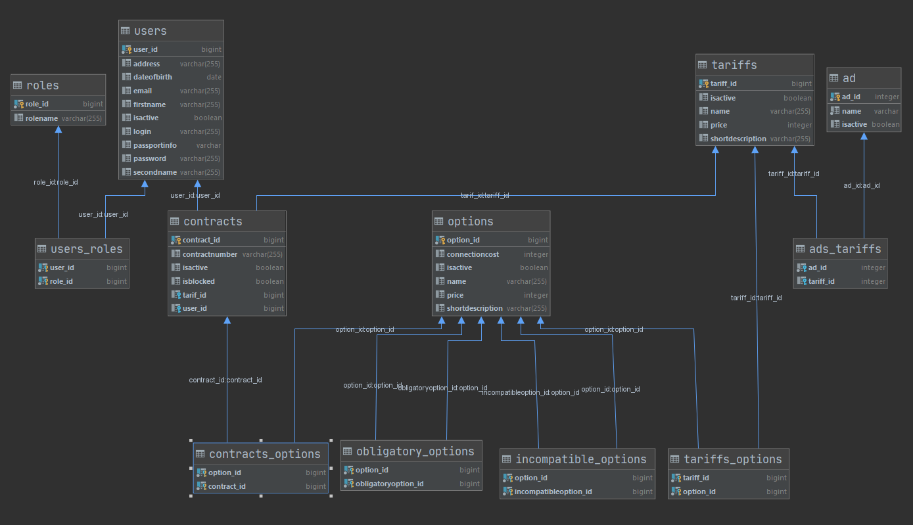

## 4. Architecture description

Application consists of two modules – main app and advertisement stand. Both at it core use
Model View Controller architectural pattern, but have different implementations on it’s basis.

Main app base on Spring MVC for controllers and requests handling, for view responsible
JSP – Java Server Pages framework, which helps to render server information on html pages. Model
is handled by Hibernate ORM (wish goes as Object Relational Mapping) for connecting entities
with database. For this application I choose relational data base PostgreSQL. For connections
between this two modules (main app and advertisement stand) I used message queen and Java
Messaging Service – industry standard API for sending messages to message broker. Messages are
sended to build-in message broker inside ad stand application server. First app is deployed on
Apache Tomcat server. All database connections are wrapped in dao (Data Acces Objects) interfaces
and it’s implementation, also for efficient using of queries there is included Transaction Manager
inside all dao related service methods.

Second application based on WildFly application server, with the same usage of MVC
pattern, but with different technology stack. In this one heavily used JSF for view-server
connection, it in a real time updates any changes received from first application. To process and
listen messages there was written Message Driven Bean.


## 5. User interface

### 5.1 Client account

#### 5.1.1. Entrance and login pages

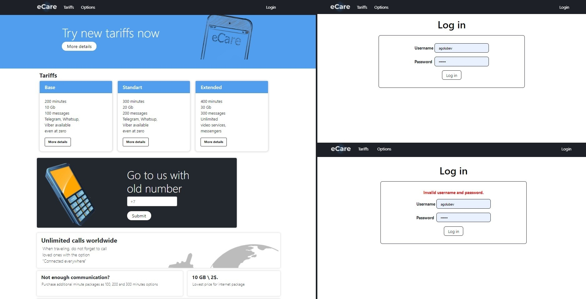

When entering app, any user will see entrance page with tariffs and options advertisements.
In top right corner there is a button for login. After clicking on it he will be redirected to login page,
in which login and password validation are implemented, and all the rest pages (except options and
tariffs information) will be blocked by Spring Security.

In view a lot of used Bootstrap forms, which is a free set of tools includes HTML and CSS design
templates for web forms, buttons, labels, navigation boxes and other web interface components.


#### 5.1.2. Clients account page and contract page

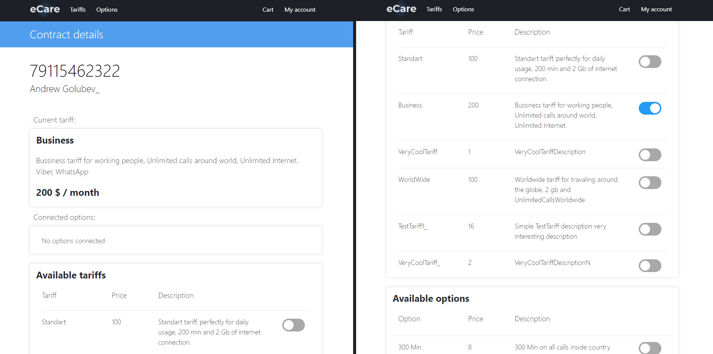

Client account page consist of a list with connected contracts. Clicking on details button will
transfer user to contract page, in which client can edit contract, based on his needs – change tariff,
change option or even block a contract. In this page heavily used JQuery and Ajax request with
JavaScript, to update page information, based on clients choice. For example during the tariff
selection, options available for this tariff will be automatically updated without page refreshing.

All option rules – obligatory and incompatible dependencies already included in selection. If
client will turn on some option which he liked, application will immediately check it dependencies,
and if it will found some, then related options will be enabled or blocked, based on the option rule.

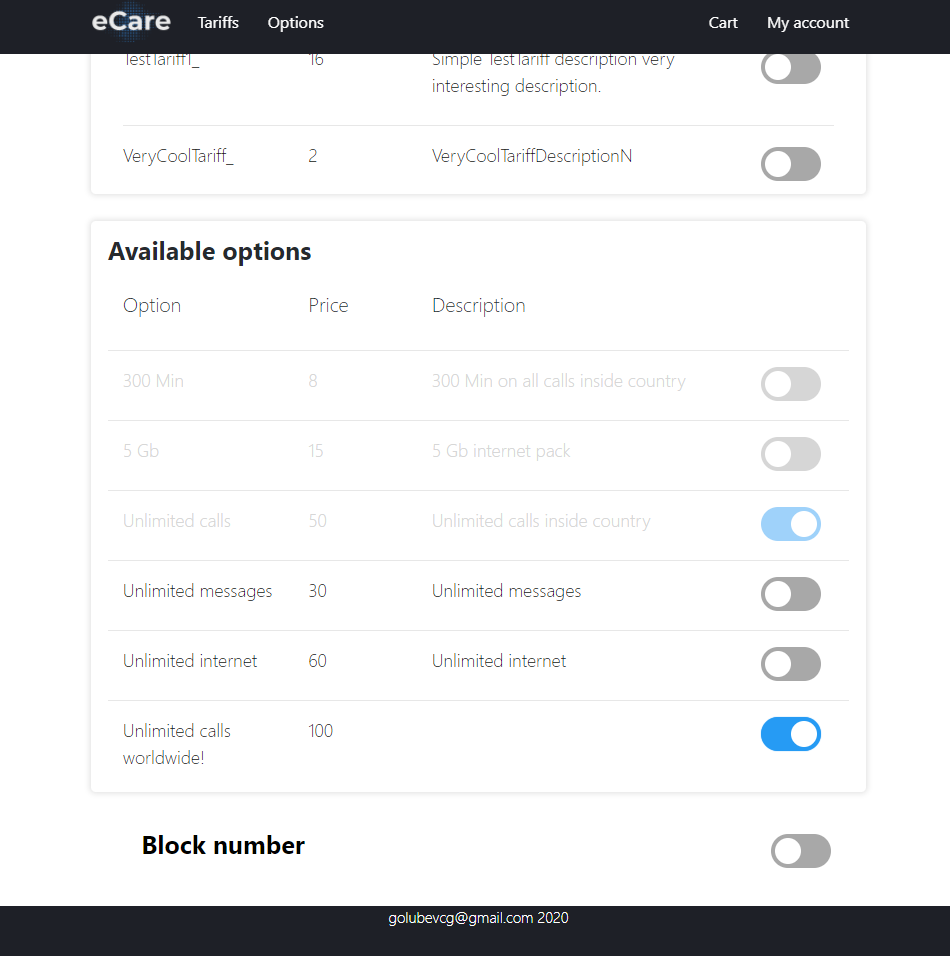

#### 5.1.3. Cart page

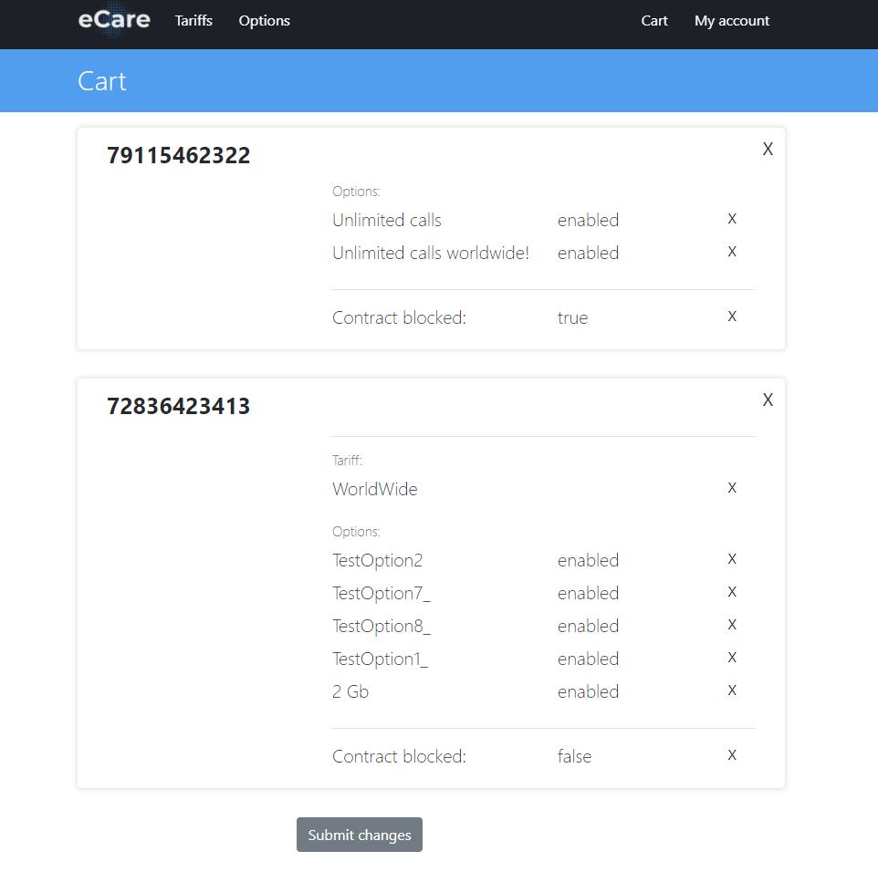

To submit changes from contracts client need to proceed in cart page, before submitting with
created changes he can for example remove any of them if he changed his mind. All changes during
this contracts editing are stored in session. When client entering contract list page in session stored
set with users contracts, and this set duplicated. On duplicated version applied all changes created in
contract page. In cart page this changes compared with values from db(which already stored in
session attribute) and difference is revealed in page.


### 5.2 Employee account

#### 5.2.1 Searches and header

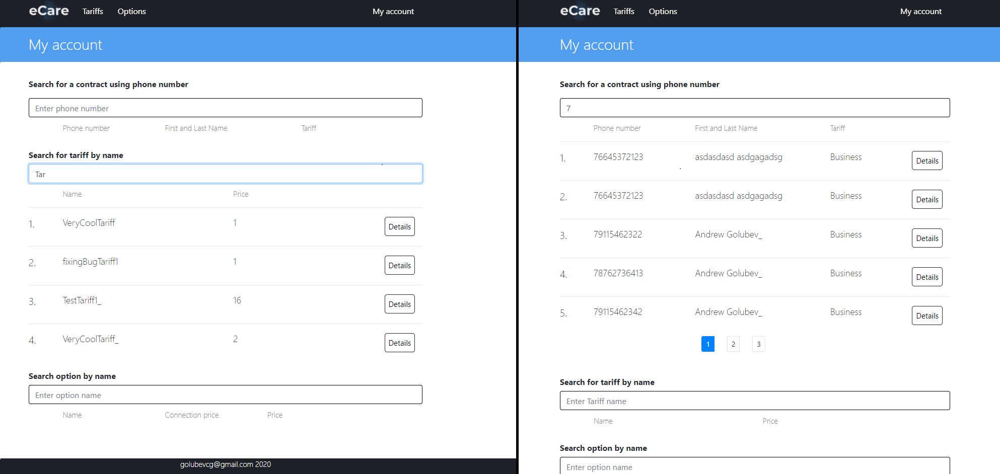

All employees inside application have “Admin” role and extended functionality. Such user
after login in will see admin account homepage. It consists from three searches, in which worker
can search for contract, tariff or option, typing in search field. Results are links, from which
employee can proceed for editing of entities, if he need so. Search results can be pretty big, so to
escape this problem in this page was pagination created, which returns 5 results at single page.


Header will depend on currently logged User role, if will change menu items, for example if
user logged as “Admin” he will see drop-down list with items like this:

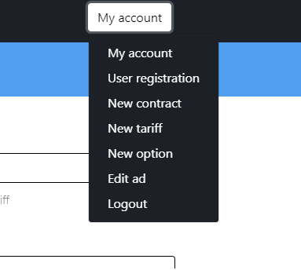

#### 5.2.2 New user registration

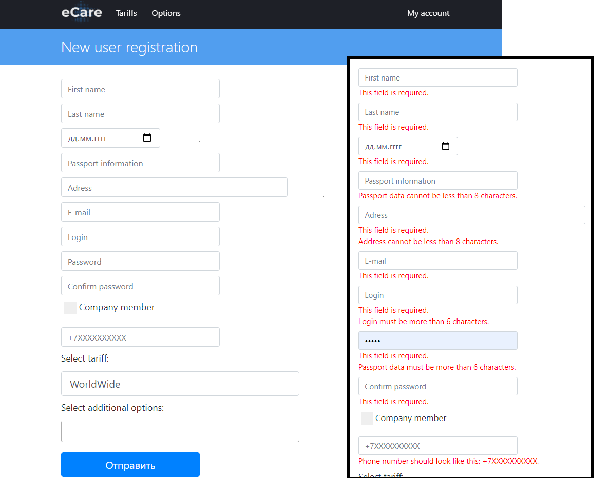

By clicking on user registration employee will be transferred to the user registration page, in
which he can register new user, add a contract to him, select tariff and set additional options. Option
list will be updated based on tariff selection. All field values have validation underneath and after
submitting this request all values will be checked and if with one of it will be something wrong it
will reveal validation message.

There is Company member checkbox, when it pressed, fields, related to contract will be
hidden. This checkbox is created to register new company employees. If this checkbox will be set,
then “Admin” role will be assign to this user, after proceeding this registration.


#### 5.2.3 Contract editing

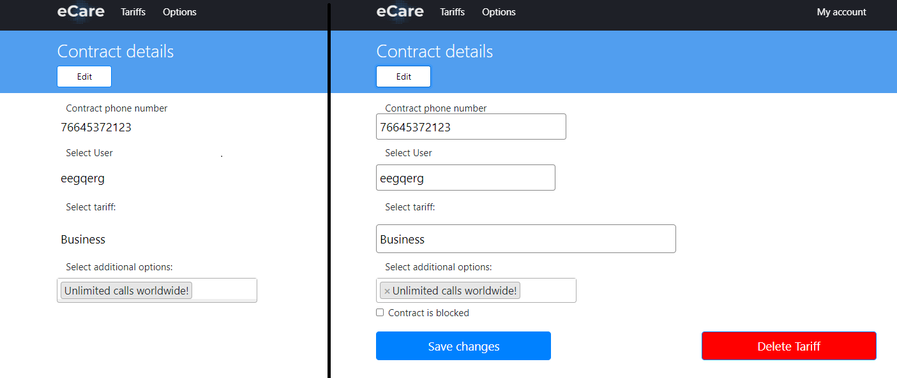

#### If in the search field find some contract and click to it, then you will be redirected to

contract editing page, in which existing contract can be changed. By default all fields are disabled,
to edit it, user need to click on edit button. This button only seen by users with “Admin” authority.
Selected user field if basically search for user by login, so if you want to change user of
current contract, you need to pick one from drop down list, which will popup during the search. If
login will be from non existing in database user, this field will be refused by validation. New
contract window looks almost the same.

#### 5.2.4 Tariff editing

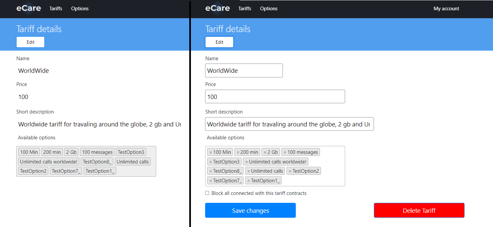

Tariff editing window look very similar to contract editing, except one thing. Because our
option have rules, in which one can be obligatory to other, we need to think about it during new
tariff registration or editing. To escape problem in which obligatory option will not be connected to
tariff, so it will be impossible to enable, so it will impossible dependency. So all connected
obligatory options to selected option will be added automatically to list. Recursively, so dependency
of depended options will be included.


#### 5.2.5 Options editing

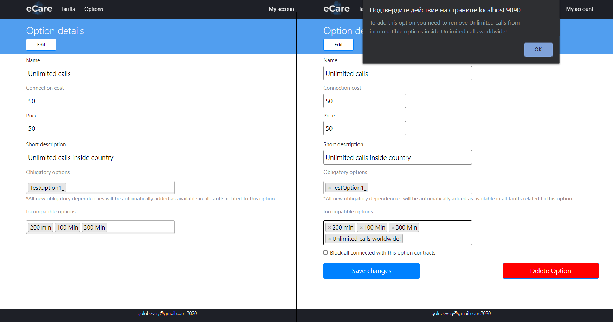

If you need to edit option you need to type option name in a search field and click on one of
the result. In option editing page you can also edit all rules, which you can apply to selected option.
For example you want to add more obligatory option for this one. Obligatory options –
options, which should be enabled in contract for enabling this option. Incompatible options –
options, which should be disabled for this option to be enabled. In order to escape from impossible
dependencies, on this page written a lot of checks. When user add new option, it will be checked for
obligatory options in parent dependencies and selected one will be checked to be compatible with
already selected ones. It all happens without page reloading, using Javascript Ajax requests. If there
is will be found some incompatible dependencies, then there is will alert window pop up, which say
which option should be changed to enable option which user chooses.


## 6. Ad editing, message sender

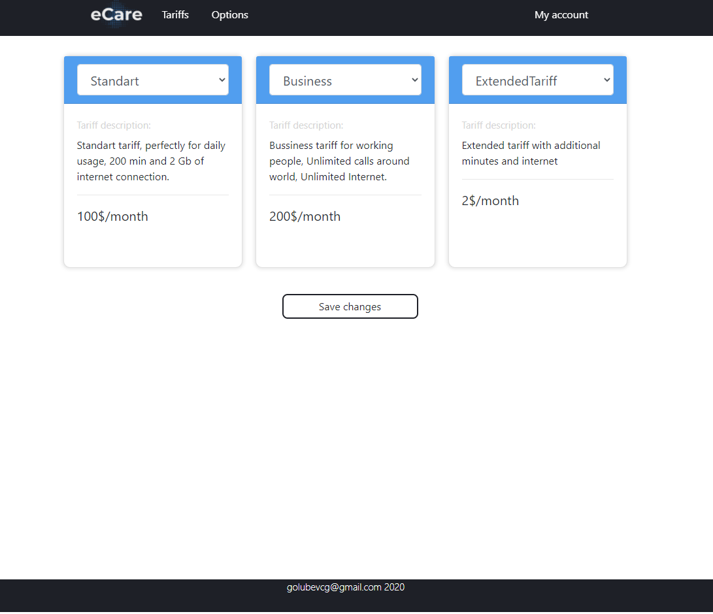

If administrator will proceed to Ad editing page, he will see three cars of tariffs, which is
currently displayed on second application advertisement stand. Changing of tariffs will result as an
immediate change in advertisement stand. For such purpose application have separate class message
sender, which connects to message broker Artemis MQ, which is included in WildFly application
server, on which eCare advertisement stand runs. Any editing of and tariff or an option will update
tariffs in ad too.


## 7. Ecare advertisment stand

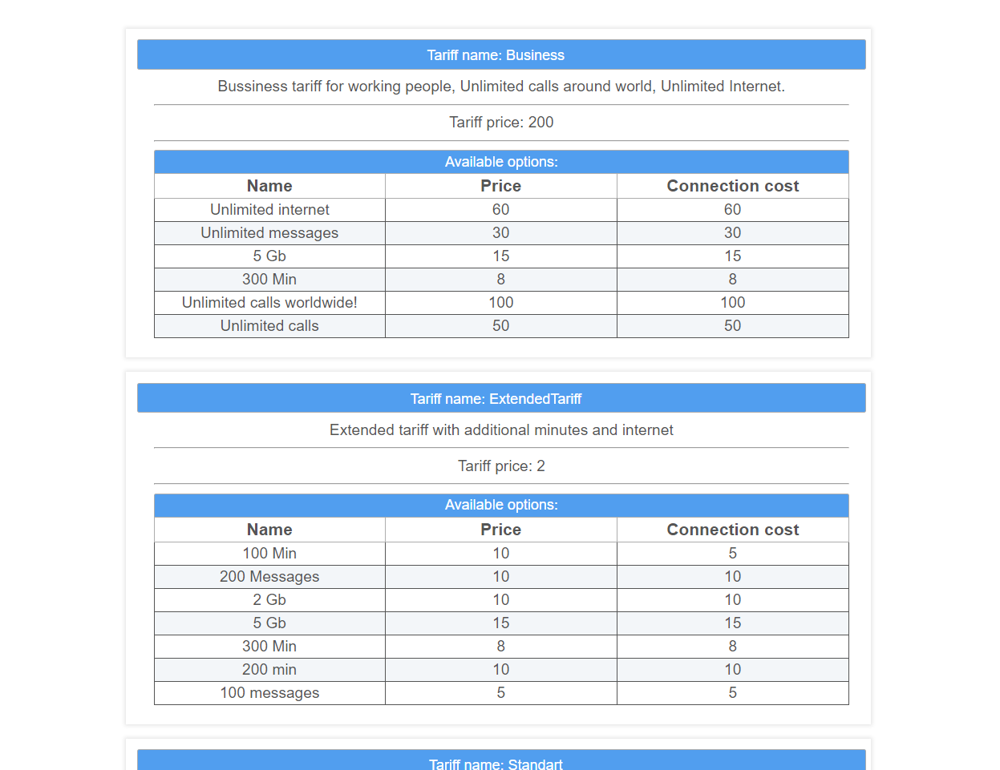

Second application used as advertisement page, which should show dependencies from first
application. So, there is a written a rest method, which takes tariffs from first application during
first deploy and each time a message received in queue it get new information from a first app.
Queue is always listened by Message Driven Bean with listener method. As a Message broker user
build in WildFly Artemis MQ, which works great. Messages in queue used only to say that first
application have some changes, please check to render page in this part we use Java Server Faces
technology and, for a real time update, without using Javascript AJAX request manually – it’s great
tool to work with.


## 8. Code quality and testing. Logs and javadoc

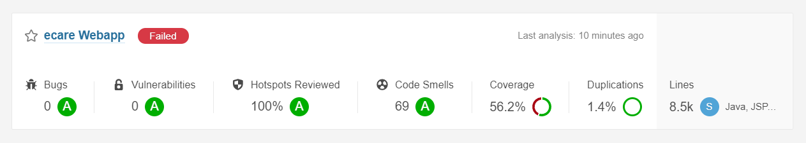

Application is checked using Sonar Qube, which is used for code quality analysis. To project
added Jacoco library, which measure test coverage of a whole project. This lib is connected to
Sonar, for showing coverage inside Sonars report. Sonar results you can look at this image:

Quality gate pass is failed because code coverage not more than 80%, there is a field to improve,
currently only 56.2% of application covered with tests.


## 9. Further development

Future development will depend on business needs, but already in a current state of
application there is a field for improvement. It would be a great idea to add another role in an app,
for example an employee, and give him part of a privileges. Because it is now so good when all
employee have all admin privileges. Also app needs a messaging system between user and
employee, for ability to send messages and receive ones on a daily basis inside this app. Next,
almost all entities have fields with price or connections cost, so adding payment system would make
sense. Ad system can be much more improved, in which there should be an ability to choose not
only tariffs, but options too. Would be a good idea to add functionally for adding new adds, and
connected them to this application. The currently developed application has a good basis for further
development and improvement of the functionality.


